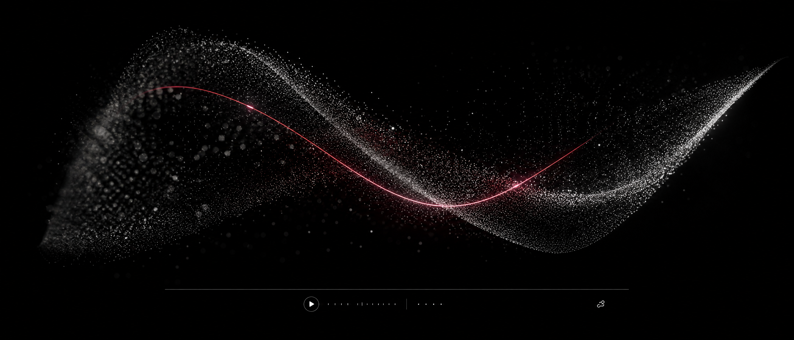
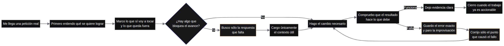

# Universal Agent Workspace

> **Una biblioteca de conocimiento operativo para trabajar con agentes.**

<p align="center"></p>

<p align="center"><sub>MERIDIAN / SPATIAL FIELD — una escena de partículas, luz y profundidad para mostrar cómo una idea puede convertirse en una experiencia web viva.</sub></p>

Estoy construyendo esta skill para resolver algo que ocurre todo el tiempo: uno le pide algo a un agente y empieza a escribir código, buscar cosas o ejecutar comandos antes de entender realmente el trabajo.

Mi intención es poner un orden sencillo antes de la acción. Primero entender. Después decidir qué contexto sirve. Luego hacer un plan corto. Sólo entonces tocar los archivos, comprobar el resultado y cerrar con evidencia.

No estoy creando una dashboard para presumir funciones. Tampoco una tienda de plugins, un chatbot o una gateway de modelos. Estoy creando una forma de trabajar que pueda leer cualquier agente capaz de usar una `SKILL.md`.

## La idea central

La skill funciona como una capa de criterio entre la petición y la ejecución. No le dice al agente que piense más por pensar. Le dice que no gaste contexto en lo que no ayuda y que no cambie cosas que nadie le pidió cambiar.

```text
petición real
     ↓
entender qué se quiere lograr
     ↓
definir qué entra y qué queda fuera
     ↓
buscar sólo lo que bloquea
     ↓
hacer el cambio necesario
     ↓
comprobar y dejar evidencia
```

> **El lujo de esta interfaz no está en los efectos. Está en el control.**

## Cómo trabajo con ella

Cuando recibo una tarea, no activo todas las capacidades disponibles. Identifico el problema dominante y elijo una capacidad principal. Si hace falta, añado como máximo tres apoyos. Cada referencia se abre sólo cuando la fase en curso la necesita.

Si la tarea es pequeña, la resuelvo en un solo hilo. Si tiene partes independientes, como datos, API, interfaz y pruebas, primero actúo como arquitecto: separo el trabajo, asigno un objetivo único a cada especialista, paso el contexto mínimo y dejo claro qué no puede tocar. Después integro las salidas y vuelvo a validar.

Si aparece un error, no vuelvo a investigar todo el proyecto. Guardo el error exacto, aíslo el archivo o función involucrada, busco la causa puntual y hago una micro-corrección. Si una acción puede borrar, publicar, pagar, enviar información o cambiar producción, me detengo y espero autorización humana.

## Lo que resuelve

| Problema habitual | Regla que aplico |
| --- | --- |
| El agente empieza sin entender el alcance. | Reformulo el objetivo y marco el fuera de alcance. |
| La investigación se vuelve infinita. | Investigo sólo el dato que desbloquea el siguiente paso. |
| El contexto se llena de información repetida. | Cargo referencias bajo demanda y descargo estado cuando ya no sirve. |
| Varios agentes hacen el mismo trabajo. | El líder define roles, límites y una salida compacta por especialista. |
| El resultado no se puede comprobar. | Termino con checks, evidencia, riesgos y pendientes. |

## Los mapas son mi forma de explicarlo

No los hice para decorar el repositorio. Los hice para que se entienda la manera de trabajar antes de entrar en todo el contenido de la skill.

<p align="center"></p>

| Mapa | Qué explica |
| --- | --- |
| [Bucle de control](skills/universal-agent-workspace/references/maps/01-control-loop.mmd) | Cómo paso de una petición real a un resultado comprobado. |
| [Selección](skills/universal-agent-workspace/references/maps/02-skill-selection.mmd) | Cómo elijo la ayuda mínima para el problema que tengo delante. |
| [UI atómica](skills/universal-agent-workspace/references/maps/03-ui-atomic.mmd) | Cómo diseño desde lo que necesita la persona y no desde una colección de componentes. |
| [Pausa ante error](skills/universal-agent-workspace/references/maps/04-pause-on-error.mmd) | Cómo paro, aíslo la causa y corrijo sin improvisar. |

Los diagramas están escritos en primera persona porque esa es la idea: explicar el método como lo usaría una persona trabajando, no como una lista de capacidades de un sistema.

## La skill que se instala

La parte importante del repositorio es esta:

```text
skills/universal-agent-workspace/SKILL.md
```

El archivo principal contiene el método común. Las referencias contienen el detalle que no conviene meter en cada conversación.

```text
skills/universal-agent-workspace/
├── SKILL.md
└── references/
    ├── efficiency-engines.md
    ├── engineering-standards.md
    ├── luxury-digital-design-system.md
    ├── creative-documentation-system.md
    ├── skills-benchmark.md
    ├── webgl/
    │   ├── webgl-shader-master-prompt.md
    │   ├── webgl-research-notes.md
    │   ├── realtime-webgl-workflow.md
    │   └── web-experience-production.md
    ├── maps/
    └── images/
```

Esta separación es importante. La skill debe ser fácil de cargar, fácil de revisar y fácil de copiar a otro agente. No depende de Node.js, Python, MCP, una API, un proveedor concreto ni un proceso corriendo detrás.

## Qué incluye

La skill reúne en un mismo método la parte de producto, arquitectura, implementación, diseño, QA, seguridad, investigación, documentación y coordinación multiagente. No intenta reemplazar las herramientas de cada área. Les da un orden de uso.

Para diseño de interfaces uso:

```text
TOKENS → ATOMS → MOLECULES → ORGANISMS → LAYOUT
```

La dirección visual es OLED, editorial, técnica y silenciosa. Uso un color de acento con significado, tipografía legible, espacio suficiente, pocos contenedores y motion sólo cuando explica una transición o un cambio de estado. Una interfaz no se vuelve mejor por parecer futurista.

Para una tarea visual, cada control debe tener estados de espera, foco, acción, carga, desactivado, éxito y error. Para una tarea con Canvas, Three.js, WebGL, WebGPU o Remotion, primero explico por qué la tecnología mejora la comprensión y después defino fallback, rendimiento y alternativa accesible.

También añadí una referencia completa para construir páginas con shaders en tiempo real. Conserva el prompt maestro de WebGL tal como lo escribí y le agrega lo que suele faltar cuando un agente intenta hacer este tipo de trabajo: presupuesto por dispositivo, `devicePixelRatio` controlado, uniforms cacheados, pérdida de contexto, fallback, reduced motion y una demostración funcional. La prueba está en [`examples/webgl/realtime-surface`](examples/webgl/realtime-surface).

<p align="center"><a href="examples/spatial-web-preview/index.html"></a></p>

La escena Meridian es el punto de entrada visual. El archivo HTML enlazado abre la experiencia viva: video, timeline, scroll, cursor, arrastre y capa 3D trabajan juntos en la misma composición.

## Un ejemplo real de uso

```text
Revisa esta API multi-tenant.
Primero dime qué problema ves y qué queda fuera.
Investiga sólo lo que no puedas resolver con el repositorio.
Haz un plan corto, modifica los archivos necesarios y demuestra las pruebas.
```

La respuesta correcta no es una lluvia de código. Es una secuencia controlada: problema, alcance, plan, cambio, comprobación y evidencia.

## Instalación

Copia la carpeta de la skill en el directorio que utilice tu agente:

```bash
git clone https://github.com/christiandejesus320-droid/universal-agent-skills-gateway.git
cp -R universal-agent-skills-gateway/skills/universal-agent-workspace \
  ~/.agents/skills/universal-agent-workspace
```

Si tu agente utiliza otra ruta, conserva la carpeta y el archivo `SKILL.md`. El formato es Markdown estándar. Los adaptadores, catálogos y herramientas opcionales del repositorio no son necesarios para usar el método.

## Validación

```bash
npm run build
npm run validate:library
npm test
python /home/ubuntu/skills/skill-creator/scripts/quick_validate.py \
  skills/universal-agent-workspace
```

Compruebo cinco cosas antes de cerrar: que la skill se descubra bien, que las instrucciones se puedan seguir, que no desperdicie contexto, que respete límites de seguridad y que el resultado tenga evidencia.

## English summary

Universal Agent Workspace is a portable operating method for model-neutral agent work. It makes an agent understand the objective, define scope, research only blockers, execute the smallest useful change, validate the result and stop with evidence. It is a Markdown skill, not a model gateway, chatbot or plugin marketplace.

## Licencia / License

MIT. Las referencias externas sirven para estudiar patrones. Antes de reutilizar código o instrucciones, reviso licencia, versión, seguridad y compatibilidad.

## Referencias / References

[1]: https://agentskills.io/specification "Agent Skills Specification"
[2]: https://github.com/garrytan/gstack "gstack"
[3]: https://github.com/vercel-labs/skills "Vercel Skills"
[4]: https://github.com/addyosmani/agent-skills "addyosmani/agent-skills"
[5]: https://agents.md/ "AGENTS.md"
[6]: https://github.com/google/skills "Google Agent Skills"
[7]: https://github.com/muratcankoylan/Agent-Skills-for-Context-Engineering "Agent Skills for Context Engineering"
