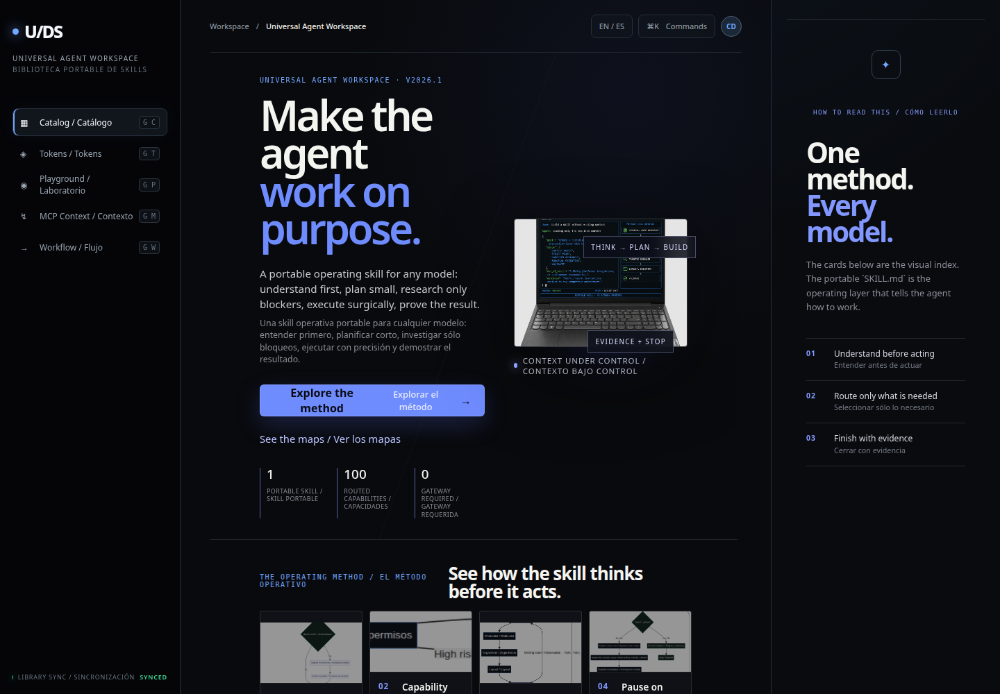
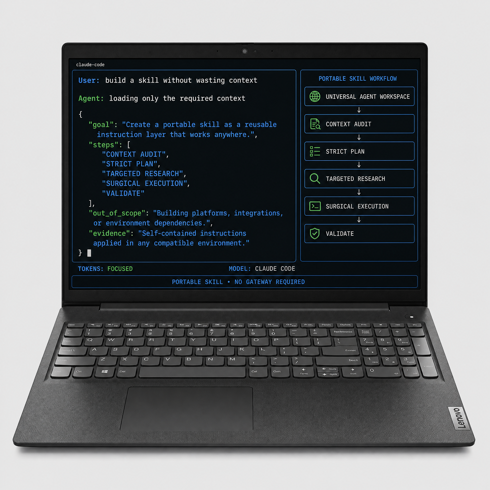
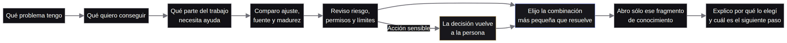
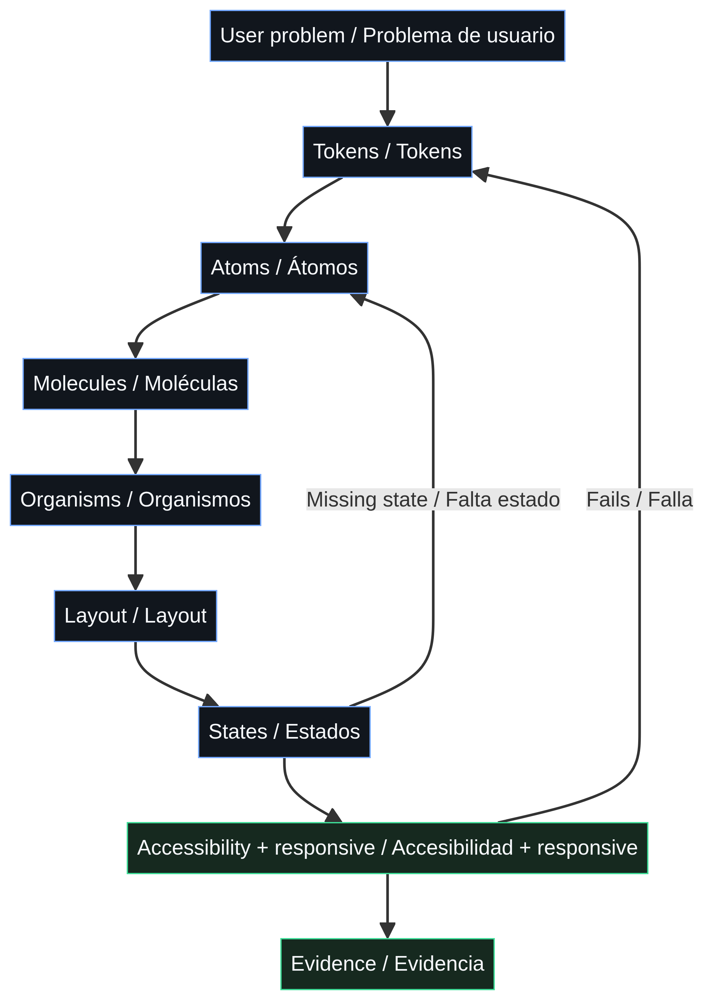
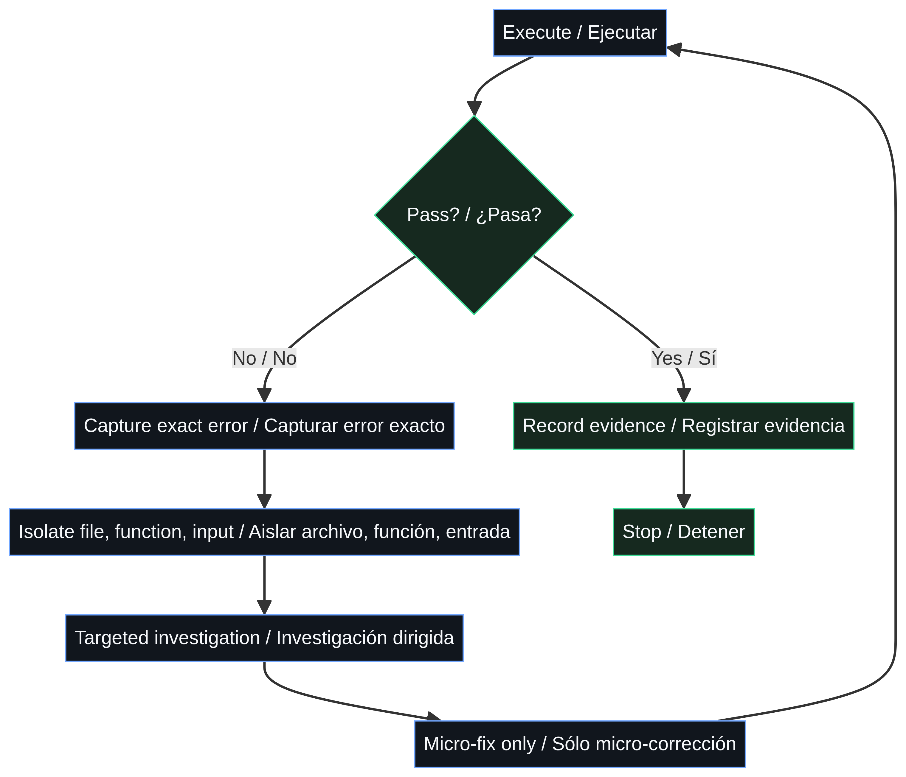

# Universal Agent Workspace

> **Una skill. Cualquier modelo. Trabajo real.**
>
> **One skill. Every model. Real work.**



Estoy construyendo una skill portable para resolver un problema concreto: que la IA no empiece a escribir código ni a ejecutar acciones a ciegas en cuanto recibe una orden.

La skill obliga al agente a **entender el objetivo, revisar el contexto disponible, investigar sólo lo que bloquea el avance, proponer un plan corto, ejecutar el cambio mínimo y demostrar que terminó correctamente**. No intento crear otro chatbot ni otro gateway. Estoy creando una forma de trabajo reutilizable para cualquier modelo que pueda leer instrucciones en Markdown.

I am building a portable skill for one specific problem: preventing an AI agent from writing code or taking action blindly as soon as it receives a request.

The skill makes the agent **understand the objective, inspect available context, research only what blocks progress, propose a short plan, execute the smallest useful change, and prove completion**. This is not a chatbot and it is not a gateway. It is a reusable operating method for any model that can read Markdown instructions.

## La idea en una imagen / The idea in one image



La interfaz visual representa el comportamiento que quiero conseguir: menos ruido, menos contexto desperdiciado y más evidencia. La skill no intenta cargar todo el conocimiento al principio. Primero muestra la ruta; después abre únicamente el recurso que hace falta.

> **THINK → PLAN → BUILD → REVIEW → TEST → SHIP → REFLECT**

## Qué problema resuelve / What problem it solves

| Antes | Con Universal Agent Workspace |
| --- | --- |
| El agente empieza a programar sin entender el alcance. | Define el problema, las restricciones y lo que queda fuera. |
| Investiga demasiado y consume contexto sin necesidad. | Investiga únicamente el bloqueo exacto. |
| Mezcla arquitectura, código, pruebas y explicación en una sola salida. | Trabaja por fases con entregables pequeños y verificables. |
| Activa muchos agentes sin límites claros. | Actúa como arquitecto principal y delega con contexto mínimo. |
| Termina diciendo que “funciona” sin demostrarlo. | Cierra con checks, evidencia, riesgos y condición de parada. |
| Depende de Claude, una API o un servicio intermediario. | Usa una única `SKILL.md` portable y neutral respecto al modelo. |

## Cómo funciona / How it works

### Primero: entender / First: understand

El agente reformula el objetivo, identifica al usuario, reconoce las restricciones, clasifica el riesgo y registra la información que falta. Si no entiende el problema, todavía no está autorizado a construir.

### Después: planificar / Then: plan

Selecciona una capacidad principal y como máximo tres capacidades de apoyo. Define archivos, secuencia, aceptación, límites y condición de parada. El plan debe ser corto porque su función es controlar la ejecución, no llenar la ventana de contexto.

### Si hace falta: delegar / When needed: delegate

En problemas con partes independientes, el agente se convierte en líder. Divide la tarea, asigna un único objetivo a cada especialista, comparte sólo el contexto mínimo y define explícitamente `in_scope` y `out_of_scope`. Los especialistas no se delegan entre sí.

### Finalmente: demostrar / Finally: prove

Ejecuta el cambio más pequeño y reversible, revisa regresiones, corre las comprobaciones proporcionales al riesgo y entrega evidencia. Las acciones externas, destructivas o irreversibles requieren un checkpoint humano.

## Mapas del método / Method maps

Los mapas no son decoración. Funcionan como una guía visual para que una persona entienda la skill antes de leer sus instrucciones completas.

| Mapa | Pregunta que responde | Vista |
| --- | --- | --- |
|  | ¿Cómo pasa una petición de contexto a evidencia? | [Abrir mapa](skills/universal-agent-workspace/references/maps/01-control-loop.mmd) |
|  | ¿Cómo decide qué capacidad activar? | [Abrir mapa](skills/universal-agent-workspace/references/maps/02-skill-selection.mmd) |
|  | ¿Cómo estructura una interfaz desde tokens hasta layout? | [Abrir mapa](skills/universal-agent-workspace/references/maps/03-ui-atomic.mmd) |
|  | ¿Cuándo debe detenerse en lugar de improvisar? | [Abrir mapa](skills/universal-agent-workspace/references/maps/04-pause-on-error.mmd) |

## La skill principal / The main skill

La entrega importante está aquí:

```text
skills/universal-agent-workspace/SKILL.md
```

La carpeta contiene una sola skill autónoma y sus referencias progresivas. El archivo principal permanece por debajo de 500 líneas para que pueda cargarse sin convertir el contexto en basura. Los detalles específicos viven en `references/` y sólo se abren cuando la tarea los necesita.

```text
skills/universal-agent-workspace/
├── SKILL.md
└── references/
    ├── efficiency-engines.md
    ├── engineering-standards.md
    ├── luxury-digital-design-system.md
    ├── creative-documentation-system.md
    ├── skills-benchmark.md
    ├── maps/
    └── images/
```

## Qué contiene / What it contains

| Área | Resultado |
| --- | --- |
| Producto y estrategia | Reformulación del problema, PRD, especificaciones y revisión de alcance. |
| Arquitectura | Dominio, datos, APIs, estados, seguridad y decisiones reversibles. |
| Ingeniería | Implementación tipada, separación de responsabilidades y estándares de producción. |
| UI y diseño | Sistema bilingüe de tokens, átomos, moléculas, organismos y layouts. |
| Creative technology | Reglas para Three.js, Canvas, shaders, WebGL, WebGPU y Remotion sin animación inútil. |
| QA y seguridad | Investigación de causa raíz, revisión, pruebas proporcionales, checkpoints y límites. |
| Multiagente | Topología, aislamiento de contexto, roles únicos y ensamblaje controlado. |
| Documentación | Salidas legibles para humanos y contratos compactos para agentes. |

## Uso real / Real use

Copia la carpeta de la skill al directorio de skills que soporte tu agente. No necesitas instalar Node.js, Python, MCP, una API ni un gateway para utilizarla.

```bash
git clone https://github.com/christiandejesus320-droid/universal-agent-skills-gateway.git
cp -R universal-agent-skills-gateway/skills/universal-agent-workspace \
  ~/.agents/skills/universal-agent-workspace
```

Después escribe una petición normal. La skill se activa cuando la tarea requiere planificación, investigación dirigida, ejecución sobre archivos, revisión, pruebas, diseño de interfaz, documentación, coordinación multiagente o control estricto del contexto.

```text
Revisa esta API multi-tenant. Primero identifica el problema y el alcance,
propón un plan corto, modifica sólo los archivos necesarios y demuestra las pruebas.
```

## Design system / Sistema de diseño

Para tareas de interfaz, la skill usa esta secuencia:

```text
TOKENS → ATOMS → MOLECULES → ORGANISMS → LAYOUT
```

El lenguaje visual parte de una base OLED, contraste alto, tipografía editorial, aire deliberado, bordes contenidos y motion con propósito. Cada interacción debe definir idle, hover, focus, active, loading, disabled, success y error. Para branding, dashboards premium, interfaces de agentes o sistemas visuales de alto nivel, la skill abre `luxury-digital-design-system.md` bajo demanda.

For interface work, the skill uses the same atomic sequence and loads the design reference only when the task requires it. The visual system favors OLED depth, high contrast, editorial hierarchy, restrained borders, purposeful motion and accessible states.

## Qué no es / What it is not

No es una gateway de modelos. No enruta peticiones entre proveedores. No exige un servidor persistente. No ejecuta automáticamente código remoto. No reemplaza los permisos del sistema operativo, un sandbox, una política de seguridad ni la confirmación humana.

El catálogo y la biblioteca visual son herramientas opcionales de apoyo. La skill sigue funcionando copiando únicamente `SKILL.md` y sus referencias necesarias.

## Validación / Validation

```bash
npm run build
npm run validate:library
npm test
python /home/ubuntu/skills/skill-creator/scripts/quick_validate.py \
  skills/universal-agent-workspace
```

La calidad se verifica en cinco dimensiones: descubribilidad, adherencia a instrucciones, economía de contexto, seguridad y evidencia de resultado.

## Licencia / License

MIT. Las referencias externas se mantienen como fuentes de patrones y deben revisarse por licencia, versión, seguridad y compatibilidad antes de reutilizar código o instrucciones.

## Referencias / References

[1]: https://agentskills.io/specification "Agent Skills Specification"
[2]: https://github.com/garrytan/gstack "gstack"
[3]: https://github.com/vercel-labs/skills "Vercel Skills"
[4]: https://github.com/addyosmani/agent-skills "addyosmani/agent-skills"
[5]: https://agents.md/ "AGENTS.md"
[6]: https://github.com/google/skills "Google Agent Skills"
[7]: https://github.com/muratcankoylan/Agent-Skills-for-Context-Engineering "Agent Skills for Context Engineering"
